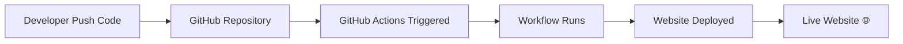

# devops-demo

# 🚀 CI/CD Pipeline with GitHub Actions

<p align="center">
  
  
  
  
</p>

---

## 📌 Project Overview

This project demonstrates a **CI/CD (Continuous Integration & Continuous Deployment)** pipeline using GitHub Actions.
Whenever code is pushed to the repository, the workflow is automatically triggered and the website is deployed.

---

## 🎯 Features

✔️ Automated deployment on every push
✔️ CI/CD pipeline using GitHub Actions
✔️ Static website hosting
✔️ Simple and beginner-friendly DevOps project

---

## 🛠️ Tech Stack

* Git & GitHub
* GitHub Actions
* HTML, CSS
* GitHub Pages

---

## 📂 Project Structure

```bash
devops-demo/
│── index.html
│── .github/
│   └── workflows/
│       └── deploy.yml
```

---

## ⚙️ Workflow Explanation

The CI/CD pipeline is defined in a YAML file:

```yaml
name: Deploy Website

on:
  push:
    branches:
      - main

jobs:
  build-deploy:
    runs-on: ubuntu-latest

    steps:
      - name: Checkout Code
        uses: actions/checkout@v4

      - name: Deploy Website
        run: echo "Website deployed successfully!"
```

---

## 🔄 How It Works



---

## 🌐 Live Demo

👉 https://<your-username>.github.io/devops-demo/

---

## 📸 Preview


---

## 💡 Key Learnings

* CI/CD pipeline fundamentals
* Workflow automation using GitHub Actions
* YAML configuration
* Version control with Git
* Deployment using GitHub Pages

---

## 🎤 Interview Q&A

**Q: What is CI/CD?**
A: CI/CD automates integration and deployment of code changes.

**Q: What triggers this pipeline?**
A: A push to the main branch triggers the workflow.

**Q: What is GitHub Actions?**
A: A tool to automate build, test, and deployment workflows.

**Q: What is YAML?**
A: A configuration language used to define workflows.

---

## 🚀 Future Enhancements

* Add testing stage
* Integrate Docker
* Deploy to cloud (AWS)
* Add monitoring

---

